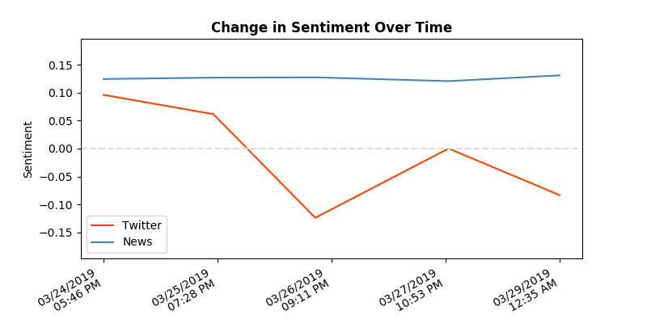

# Social and News Media Analysis
### By: Austin Bristol

This project was completed for a senior thesis project at Allegheny College. The system was written in Python 3, and uses a suite of technologies to perform sentiment analysis of social media and news data.

## Overview

This software system allows users to collect large amounts of media data from Twitter and various news sources, and analyzes this information to extract valuable insights in the sentiment that users display on the platforms. By using a easy-to-use web interface, users can set up a cluster of AWS machines to perform the analytics with a click of a button. Also, the user can easily query the system for whatever search topic that they want to perform analytics on, as well as saving previous results to be viewed later. Visualizations are produced as a result of the analytics, and can be used to gain insights on the input topic.

### Examples

You can view how the system works all together by viewing the following [demo
video](https://youtu.be/oO-sEbG8oZI). Also, Below shows various example
visualizations that are produced by this software system. Included, the overall
sentiment visualization, a sentiment bar graph, mood pie chart, sentiment change
line graph, and emoticon table.

</img>

</img>

</img>

</img>

</img>

### Technology

There were a suite of technologies used in the development of the project. Specifically, a lot of different Python packages were used to complete this project. Also, Amazon Web Services were used in great detail as well. Below is a listing of the technologies that were used in this project:

- [Python 3.6](<https://www.python.org/>)

- [Flask](<http://flask.pocoo.org/>)

- [python-twitter](<https://python-twitter.readthedocs.io/en/latest/>)

- [News API](<https://newsapi.org/docs/client-libraries/python>)

- [Newspaper3k](<https://github.com/codelucas/newspaper>)

- [Natural Language Toolkit](<https://www.nltk.org/>)

- [Matplotlib](<https://matplotlib.org/>)

- [AWS SDK for Python](<https://aws.amazon.com/sdk-for-python/>)

- [AWS EC2](<https://aws.amazon.com/ec2/>)

- [PostgreSQL](<https://www.postgresql.org/>)

## Prerequisites

## Installation
